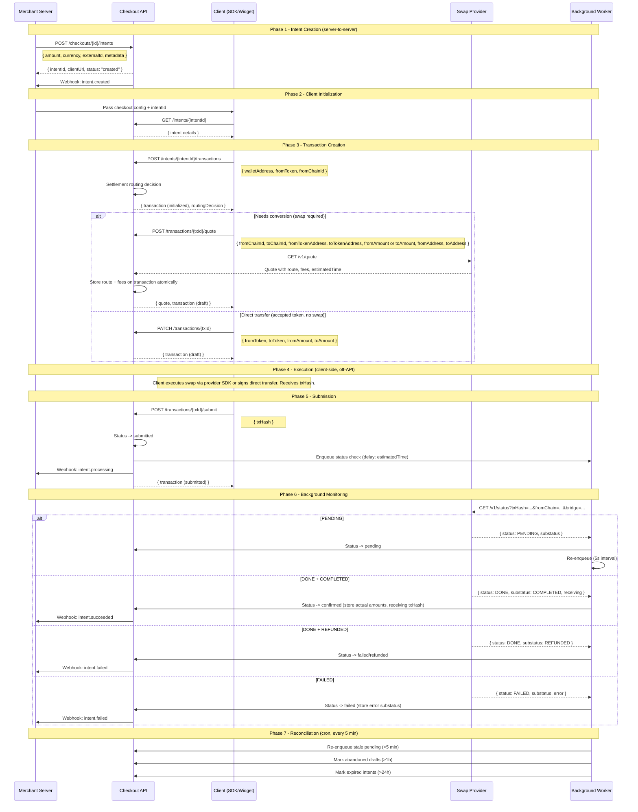

# V1 Checkout API -- Technical Spec

---

## Reference Docs

**Internal:**

- V1 Product Requirements Document (DWC-V1 PRD)
- Settlement Routing Rules (DWC Settlement Routing Rules)

**LI.FI API (initial swap provider):**

- [API Overview](https://docs.li.fi/api-reference/introduction)
- [Get Quote (`GET /v1/quote`)](https://docs.li.fi/api-reference/get-a-quote-for-a-token-transfer) -- returns route with `transactionRequest`, `estimate.executionDuration`, `estimate.feeCosts[]`, `estimate.gasCosts[]`, `estimate.toAmountMin`
- [Check Status (`GET /v1/status`)](https://docs.li.fi/api-reference/check-the-status-of-a-cross-chain-transfer) -- returns `sending`, `receiving` (actual amounts, txHash, timestamps), `feeCosts[]`, `substatus`
- [Status Tracking Guide](https://docs.li.fi/introduction/user-flows-and-examples/status-tracking) -- substatus definitions for PENDING, DONE, FAILED
- [Rate Limits](https://docs.li.fi/api-reference/rate-limits) -- 200 req/min with API key (24k per 2h rolling window), 200 req/2h without
- [Error Codes](https://docs.li.fi/api-reference/error-codes)
- [Monetizing Integration (fees)](https://docs.li.fi/introduction/integrating-lifi/monetizing-integration)
- [Supported Chains](https://docs.li.fi/introduction/chains)
- [OpenAPI Spec (YAML)](https://raw.githubusercontent.com/lifinance/public-docs/main/openapi.yaml)

**LI.FI endpoints not yet used (relevant for V1):**

- [`GET /v1/tokens`](https://docs.li.fi/api-reference/fetch-all-known-tokens) -- list supported tokens per chain (useful for settlement routing validation)
- [`GET /v1/chains`](https://docs.li.fi/api-reference/get-information-about-all-currently-supported-chains) -- list supported chains
- [`GET /v1/connections`](https://docs.li.fi/api-reference/get-available-connections-for-a-specific-token) -- which token pairs can be swapped (useful for config validation)
- [`GET /v1/tools`](https://docs.li.fi/api-reference/get-available-bridges-and-exchanges) -- available bridges and DEXes (useful for bridge/exchange restriction config)

---

## 1. Swap Provider Abstraction

### Current State

LI.FI is called directly in two places today:

- **Quote** -- called from the transaction quote handler when a transaction needs token conversion.
- **Status** -- called from the background worker on a loop to track cross-chain transaction progress.

Both are tightly coupled to LI.FI. The proposal is to introduce a provider-agnostic swap abstraction so that LI.FI, Relay.link, or any future provider can be swapped without touching transaction logic.

### Proposed Swap API Surface

Two operations need to be provider-agnostic:

**Get Quote** -- Given a source token/chain and destination token/chain, return a route with amounts and fees.

```
Internal service call: swapService.getQuote(request)

Request:
  fromChainId, toChainId, fromTokenAddress, toTokenAddress,
  fromAmount OR toAmount,    -- exactly one required (see quoting direction below)
  fromAddress, toAddress

Response (SwapQuoteResult):
  route          -- provider-opaque route object, stored on transaction and returned to client for SDK execution
  fromToken      -- normalized token (symbol, address, chainId, decimals, priceUSD)
  toToken        -- normalized token
  fromAmount     -- raw amount (smallest unit)
  toAmount       -- raw amount
  toAmountMin    -- minimum guaranteed after slippage
  fees           -- { gasCostUsd, bridgeCostUsd, providerFeeUsd, integratorFeeUsd, totalUsd }
  estimatedTime  -- seconds (used to delay first status poll)
  provider       -- "lifi" | "relay" | ...
  tool           -- specific DEX/bridge used (e.g., "stargate", "1inch")
```

**Quoting direction** -- The request must specify either `fromAmount` or `toAmount`, not both:

- **Payment mode** (`toAmount`): "The merchant needs to receive exactly 49.99 USDC. How much ETH does the user need to send?" This ensures the merchant gets the exact amount.
- **Deposit mode** (`fromAmount`): "The user wants to send 0.02 ETH. How much USDC arrives?" This lets the user control how much they spend.

LI.FI's `/v1/quote` endpoint accepts `fromAmount` natively. For `toAmount`-based quoting, the adapter must either use a reverse-quote approach or iteratively estimate the required `fromAmount`.

**Quote expiry** -- Quotes are volatile. Prices, gas costs, and liquidity can change between quote time and execution time. The `route` object returned by the provider typically encodes the price at quote time. If the user takes too long to confirm:

- The `toAmountMin` (slippage floor) protects against minor price movement.
- If slippage exceeds the floor, the on-chain transaction reverts.
- Recommended: re-quote if more than 60 seconds have elapsed since the quote was fetched.

**Route storage** -- The provider-opaque `route` object is stored on the transaction record at quote time. The client retrieves it via the quote response or by fetching the transaction. This ensures the route survives page refreshes.

**Check Status** -- Given a transaction hash, return execution status.

```
Internal service call: swapService.getStatus(txHash, fromChainId, toChainId, tool)

Response (SwapStatusResult):
  status         -- "PENDING" | "DONE" | "FAILED" | "NOT_FOUND"
  substatus      -- provider-specific detail (COMPLETED, PARTIAL, REFUNDED, etc.)
  sending        -- { amount, amountUsd, txHash, gasUsed, gasAmountUsd, timestamp }
  receiving      -- { amount, amountUsd, token, txHash, timestamp }
  fees           -- actual fees post-execution
  explorerUrl    -- link to explorer
  error          -- error message if failed
```

These are internal service calls, not exposed as public API endpoints. They are consumed by the quote handler and background worker.

### Provider Interface

The swap service should be structured as a provider registry with pluggable adapters:

```
swap/
  types.ts           -- SwapProvider interface, normalized types
  index.ts           -- provider registry, routes to active provider
  providers/
    lifi.ts          -- LI.FI adapter
    relay.ts         -- future Relay.link adapter
```

The interface:

```typescript
interface SwapProvider {
  name: string;
  getQuote(params: SwapQuoteRequest): Promise<SwapQuoteResult>;
  getStatus(txHash: string, fromChainId: number, toChainId: number, tool?: string): Promise<SwapStatusResult>;
}
```

### What Changes

- The existing LI.FI service gets wrapped by a `LiFiSwapProvider` adapter that normalizes responses into `SwapQuoteResult` / `SwapStatusResult`.
- The quote handler and worker handler call `swapService.getQuote()` / `swapService.getStatus()` instead of calling LI.FI directly.
- Transaction records store normalized fee data (see section 2) instead of provider-specific fields.
- The `tool` field on the transaction becomes `{ provider: "lifi", tool: "stargate" }` to distinguish provider from specific route tool.

### Fee Normalization

Every quote response must return a normalized fee breakdown. Today, LI.FI returns fees inside `estimate.gasCosts[]` and `estimate.feeCosts[]` on each step. These need to be extracted and flattened into:

```typescript
interface SwapFees {
  gasCostUsd: string;
  bridgeCostUsd: string;
  providerFeeUsd: string;     // DEX/bridge provider fee
  integratorFeeUsd: string;   // our fee
  totalFeeUsd: string;
}
```

This normalized structure gets stored on the transaction and included in webhook payloads.

**Example**: LI.FI returns a quote where `estimate.gasCosts` has two entries (approval + send) totaling $0.85, and `estimate.feeCosts` has a relay fee of $0.12 and an integrator fee of $1.50. The adapter flattens this to:

```json
{
  "gasCostUsd": "0.85",
  "bridgeCostUsd": "0.12",
  "providerFeeUsd": "0.00",
  "integratorFeeUsd": "1.50",
  "totalFeeUsd": "2.47"
}
```

### LI.FI Data Gaps (must fix in adapter)

The current LI.FI integration drops significant data from both the quote and status responses. The adapter must capture these.

#### Quote Response (`/v1/quote`) -- not captured today

| Field | Why it matters |
|---|---|
| `estimate.executionDuration` | Seconds. Used to delay first status poll instead of polling immediately. See [status tracking guide](https://docs.li.fi/introduction/user-flows-and-examples/status-tracking). |
| `estimate.toAmountMin` | Minimum guaranteed amount after slippage. Needed for merchant expectations and billing accuracy. |
| `estimate.feeCosts[]` | Array of bridge fees, relay fees, integrator fees -- each with `name`, `amount`, `amountUSD`, `percentage`, `included`. **Currently not captured at all.** Only `gasCosts[0].amountUSD` is extracted. This is the critical gap for BPS billing. |
| All `gasCosts[]` entries | We take only `gasCosts[0]`. LI.FI can return multiple entries (approval + send). Must sum all. |

#### Status Response (`/v1/status`) -- not captured today

| Field | Why it matters |
|---|---|
| `receiving.amount`, `receiving.amountUSD` | Actual amount the merchant received. May differ from quote estimate. Essential for reconciliation. |
| `receiving.txHash`, `receiving.txLink` | Destination chain tx hash. Different from source chain hash for cross-chain. Needed for proof of delivery. |
| `receiving.token` | Actual token received. In `PARTIAL` cases this may differ from expected. |
| `sending.amount`, `sending.amountUSD` | Actual amount sent (vs estimated). |
| `sending.gasUsed`, `sending.gasAmountUSD` | Actual gas consumed (vs estimated). |
| `feeCosts[]` | Actual fees post-execution (vs estimated at quote time). |
| `sending.timestamp`, `receiving.timestamp` | Actual execution timestamps for settlement time tracking. |

#### Status Substatus Handling

| LI.FI Status | Substatus | Current behavior | Correct behavior |
|---|---|---|---|
| `DONE` | `COMPLETED` | Mark confirmed | Correct |
| `DONE` | `PARTIAL` | Mark confirmed | Flag as partial -- merchant may have received a different token |
| `DONE` | `REFUNDED` | **Mark confirmed (BUG)** | Mark as **failed/refunded** -- merchant did NOT receive funds |
| `FAILED` | `SLIPPAGE_EXCEEDED`, `OUT_OF_GAS`, etc. | Generic fail | Store substatus as `errorMessage` for debugging and potential retry logic |
| `PENDING` | `BRIDGE_NOT_AVAILABLE` | Keep polling | Should alert -- bridge is down, not just slow |

The `DONE + REFUNDED` case is the highest priority fix. See [substatus definitions](https://docs.li.fi/introduction/user-flows-and-examples/status-tracking).

#### Status Endpoint -- missing parameter

The `getStatus()` call should also pass `bridge` (the tool/bridge from the stored quote) to the status endpoint. This speeds up lookups per LI.FI docs. Today we only pass `fromChain` and `toChain`.

#### Quote Parameters -- not yet exposed

Available on [`GET /v1/quote`](https://docs.li.fi/api-reference/get-a-quote-for-a-token-transfer) but not yet exposed in checkout config:

- `allowBridges`/`denyBridges` -- restrict which bridges can be used (compliance)
- `allowExchanges`/`denyExchanges` -- restrict which DEXes can be used
- `fromAmountForGas` -- convert part of transfer to gas on destination chain

These should be exposable as optional merchant configuration.

---

## 2. Payment Intent & Transaction Lifecycle

### Current State vs Intent Model

**Today**: No payment intent concept. A transaction is created client-side on wallet connect. The merchant has no server-to-server step to initiate a specific payment.

**V1 target**: Introduce a **payment intent** as the merchant-initiated entry point. Created server-to-server, captures the merchant's requirements (amount, metadata, externalId), and returns an ID for the client to complete. Aligns with Stripe's `PaymentIntent` model and the PRD's `createPayWithCryptoIntent()` API.

### Entity Model

- **Checkout** -- Merchant-level config. Created once. Defines mode, settlement, routing rules, webhooks. Reusable across many intents.
- **Payment Intent** -- Represents **what** the merchant wants to happen. Per-payment session, created server-to-server. Captures the merchant's requirements: amount, currency, externalId, metadata, expiry. Merchant-facing -- the merchant tracks payment status via intent status and webhooks.
- **Transaction** -- Represents **how** a specific attempt to fulfill the intent is executed. Captures the user's choices and execution details: which token they're paying with, the swap route, quote, fees, and eventually the on-chain txHash and confirmation. A transaction starts off-chain (token selection, quoting) and goes on-chain (submission, confirmation). A single intent may have multiple transactions if earlier attempts fail or are cancelled.

### Lifecycle Swimlane



### Status Definitions

**Intent statuses:**

- **created** -- Merchant created the intent. Waiting for user to begin.
- **processing** -- An on-chain transaction has been submitted. Awaiting confirmation.
- **succeeded** -- Payment confirmed. Funds arrived at destination.
- **failed** -- All transaction attempts exhausted or permanently failed. Merchant did NOT receive funds.
- **expired** -- No activity within TTL. No further transactions allowed.

**Intent status transitions:**

```
created  ──→  processing  ──→  succeeded
   ↑              │
   │              ├──→  failed (permanent)
   │              │
   └──────────────┘
   (tx failed/cancelled, retry allowed)

created  ──→  expired (TTL, cron)
```

**Intent-to-transaction status mapping:**

| Transaction event | Intent transition | Notes |
|---|---|---|
| Transaction submitted (`submitted`) | `created` --> `processing` | First on-chain submission |
| Transaction confirmed (`confirmed`) | `processing` --> `succeeded` | Terminal success |
| Transaction failed (`failed`) | `processing` --> `created` | Allows retry with new quote |
| Transaction cancelled (`cancelled`) | `processing` --> `created` | User cancelled, can try again |
| Transaction failed + max retries | `processing` --> `failed` | Terminal failure |
| No activity within TTL | `created` --> `expired` | Cron cleanup |

When an intent returns to `created` after a failure, the failed transaction stays in `failed` status. The client creates a new transaction on the same intent via `POST /intents/{id}/transactions`. This is the retry path -- each retry is a new transaction record, not a re-quote of the old one.

**Transaction statuses** (internal, tracks a single on-chain execution attempt):

- **initialized** -- Transaction record created. No route data yet.
- **draft** -- Route data stored (tokens, amounts, fees). Ready for on-chain execution.
- **submitted** -- txHash received. On-chain but not yet confirmed.
- **pending** -- Source chain confirmed. For cross-chain: waiting for bridge/destination.
- **confirmed** -- Fully complete. Funds arrived at destination.
- **failed** -- On-chain failure, bridge failure, refund, or max retries on status polling.
- **cancelled** -- Client-initiated cancellation before submission.
- **abandoned** -- Cleanup: drafted but never submitted (1h TTL).

**Relationship**: Each intent can have multiple transactions (one per attempt). Only one transaction per intent can be in a non-terminal state at a time. Intent status is derived from the latest transaction's status per the mapping table above.

**Amount semantics by mode:**

- **Payment mode**: `amount` is set by the merchant when creating the intent (required). It represents the exact USD value the merchant expects to receive.
- **Deposit mode**: `amount` is optional at intent creation. If not set, it is captured when the user enters their deposit amount (stored on the transaction, not the intent). The intent's `amount` field remains null until a transaction provides it.

### Terminal vs Retryable

- **Terminal (done)**: `confirmed`, `expired`, `abandoned`
- **Retryable (can re-quote back to draft)**: `cancelled`, `failed`
- **Immutable (cannot modify)**: `submitted`, `pending`, `confirmed`

### Status Machine (transaction level)

A single transaction moves forward only. Retries after failure create a new transaction on the same intent (see intent status mapping above).

```
initialized ──→ draft ──→ submitted ──→ pending ──→ confirmed
     │            │ ↺          │            │
     │          re-quote       │            │
     │            │            │            │
     └→ cancelled └→ cancelled └→ failed    └→ failed
                  └→ failed
                  └→ abandoned (cron 1h)
```

**Transition triggers:**

- `initialized → draft`: `POST /quote` or `PATCH /transactions`
- `draft → draft`: `POST /quote` (re-quote, e.g., user switches tokens or quote expires)
- `draft → submitted`: `POST /submit` (txHash received)
- `submitted → pending`: worker (source chain confirmed, cross-chain bridge in progress)
- `submitted → confirmed`: worker (single-chain swap, instant confirmation)
- `pending → confirmed`: worker (destination chain confirmed)
- `submitted/pending → failed`: worker (on-chain failure, bridge failure, refund, max retries)
- `initialized/draft → cancelled`: `PATCH /status` (client cancellation)
- `draft → failed`: `PATCH /status` (client-reported failure)
- `draft → abandoned`: cron (1h with no activity)

After submission, the transaction is immutable -- no re-quoting. If it fails, the intent reverts to `created` and a new transaction can be started.

### Data Models

**Payment Intent:**

```json
{
  "id": "int_xyz789",
  "checkoutId": "chk_456",
  "status": "created",
  "amount": "49.99",
  "currency": "USD",
  "externalId": "order-A100293",
  "metadata": { "orderId": "A-100293" },
  "expiresAt": "2026-02-12T14:30:00Z",
  "createdAt": "2026-02-11T14:30:00Z",
  "updatedAt": "2026-02-11T14:30:00Z"
}
```

**Transaction:**

```json
{
  "id": "tx_def456",
  "intentId": "int_xyz789",
  "checkoutId": "chk_456",
  "status": "confirmed",
  "walletAddress": "0x552008c0f6870c2f77e5cc1d2eb9bdff03e30ea0",
  "fromChainId": 1,
  "toChainId": 8453,
  "fromToken": {
    "symbol": "ETH", "address": "0x0000...", "chainId": 1,
    "decimals": 18, "name": "Ethereum", "priceUSD": "2500.00"
  },
  "toToken": {
    "symbol": "USDC", "address": "0x833...", "chainId": 8453,
    "decimals": 6, "name": "USD Coin", "priceUSD": "1.00"
  },
  "fromAmount": "20000000000000000",
  "toAmount": "49990000",
  "toAmountMin": "49490100",
  "fees": {
    "gasCostUsd": "0.85",
    "bridgeCostUsd": "0.12",
    "providerFeeUsd": "0.00",
    "integratorFeeUsd": "0.50",
    "totalFeeUsd": "1.47"
  },
  "estimatedTime": 120,
  "provider": "lifi",
  "tool": "stargate",
  "sendingTxHash": "0xabc...123",
  "receivingTxHash": "0xdef...456",
  "sendingAmount": "20000000000000000",
  "sendingAmountUsd": "50.00",
  "receivingAmount": "49990000",
  "receivingAmountUsd": "49.99",
  "errorMessage": null,
  "retryCount": 0,
  "createdAt": "2026-02-11T14:28:00Z",
  "updatedAt": "2026-02-11T14:30:00Z",
  "completedAt": "2026-02-11T14:29:55Z"
}
```

Fields like `receivingTxHash`, `receivingAmount`, `receivingAmountUsd` are populated by the background worker from the swap provider's status response after confirmation. They represent the actual on-chain result (which may differ from the quote estimate).

### Authentication

Three auth levels are used across the API:

- **API key** (server-to-server): Issued per merchant. Passed via `Authorization: Bearer <key>` header. Used for checkout management and intent creation. Keys are provisioned through the dashboard.
- **Client JWT**: Issued by the auth provider (e.g., Dynamic SDK) when a user connects their wallet. Passed via `Authorization: Bearer <jwt>` header. Contains the user's session info. Used for transaction operations -- the API validates that the JWT's wallet address matches the transaction's `walletAddress`.
- **Public**: No auth required. Used for read-only endpoints that the client needs during the payment flow (get intent details).

### Error Responses

All error responses follow a consistent format:

```json
{
  "error": {
    "code": "CONFLICT",
    "message": "Cannot get quote for transaction with status \"submitted\". Transaction is already in progress.",
    "details": { "currentStatus": "submitted", "allowedStatuses": ["initialized", "draft"] }
  }
}
```

Standard HTTP status codes:

- `400` -- Validation error (bad input, missing fields)
- `401` -- Authentication required or invalid
- `403` -- Forbidden (valid auth but not authorized for this resource)
- `404` -- Resource not found
- `409` -- Conflict (invalid state transition, duplicate externalId)
- `422` -- Unprocessable (e.g., no swap route found)
- `429` -- Rate limited
- `500` -- Internal error

### Idempotency

- **Create Intent**: Idempotent on `externalId`. If an intent with the same `externalId` already exists for the checkout, the existing intent is returned (not duplicated). Response includes `created: false` to indicate this.
- **Submit Transaction**: Idempotent on `txHash`. Submitting the same txHash twice for the same transaction returns the existing submitted transaction without error.
- **Create Transaction**: NOT idempotent. Each call creates a new transaction. Guard against duplicates by checking the intent's current transaction state before creating.
- **Webhooks**: Each event has a unique `id` field. Merchants should deduplicate on this ID in case of retry delivery.

### API Routes

#### Create Payment Intent

```
POST /api/checkouts/{checkoutId}/intents
```

- Auth: API key (server-to-server)
- Effect: Creates intent in `created` status. Returns a `clientUrl` for rendering.
- Deduplication: If `externalId` already exists for this checkout, returns the existing intent.
- Webhook: `intent.created`

```json
// Request
{
  "amount": "49.99",
  "currency": "USD",
  "externalId": "order-A100293",
  "metadata": { "orderId": "A-100293", "userId": "user_42" },
  "expiresIn": 3600
}

// Response
{
  "intent": {
    "id": "int_xyz789",
    "checkoutId": "chk_456",
    "status": "created",
    "amount": "49.99",
    "currency": "USD",
    "externalId": "order-A100293",
    "expiresAt": "2026-02-11T15:30:00Z",
    "createdAt": "2026-02-11T14:30:00Z"
  },
  "clientUrl": "https://pay.example.com/i/int_xyz789"
}
```

#### Get Intent

```
GET /api/intents/{intentId}
```

- Auth: Public or API key
- Returns: `{ intent, latestTransaction? }`

#### Create Transaction

```
POST /api/intents/{intentId}/transactions
```

- Auth: Client JWT
- Input: `{ walletAddress, fromToken, fromChainId }`
- Effect: Creates transaction in `initialized` status, linked to intent. The server runs the settlement routing decision based on the checkout config and the user's selected token.
- Validation: Intent must be in `created` status. No other non-terminal transaction may exist on this intent.
- Returns: `{ transaction, routingDecision }`

The `routingDecision` tells the client what to do next:

```json
// Passthrough (no conversion needed)
{
  "transaction": { "id": "tx_def456", "status": "initialized" },
  "routingDecision": {
    "action": "passthrough",
    "destinationAddress": "0x9c040e69a7e1866717e0a7a09d3484c718a1e8e7",
    "destinationChainId": 1
  }
}

// Conversion required (must call POST /quote next)
{
  "transaction": { "id": "tx_def456", "status": "initialized" },
  "routingDecision": {
    "action": "convert",
    "settlementToken": { "symbol": "USDC", "chainId": 8453, "address": "0x833...", "decimals": 6 },
    "destinationAddress": "0x9c040e69a7e1866717e0a7a09d3484c718a1e8e7"
  }
}
```

- If `action` is `"passthrough"`: client calls `PATCH /transactions/{txId}` with the token details, then proceeds to execution.
- If `action` is `"convert"`: client calls `POST /transactions/{txId}/quote` with the settlement token as destination, then proceeds to review and execution.

#### Get Quote

```
POST /api/transactions/{txId}/quote
```

- Auth: Client JWT
- Effect: Calls swap provider, stores route + fees + estimatedTime atomically, transitions to `draft`.
- Allowed from: `initialized`, `draft`
- Blocked when: `submitted`, `pending`, `confirmed`, `cancelled`, `failed` (terminal transactions cannot be re-quoted; create a new transaction instead)

```json
// Request (payment mode -- quote by toAmount)
{
  "fromChainId": 1,
  "toChainId": 8453,
  "fromTokenAddress": "0x0000000000000000000000000000000000000000",
  "toTokenAddress": "0x833589fCD6eDb6E08f4c7C32D4f71b54bdA02913",
  "toAmount": "49990000",
  "fromAddress": "0x552008c0f6870c2f77e5cc1d2eb9bdff03e30ea0",
  "toAddress": "0x9c040e69a7e1866717e0a7a09d3484c718a1e8e7"
}

// Request (deposit mode -- quote by fromAmount)
// {
//   ...same fields but with "fromAmount": "20000000000000000" instead of "toAmount"
// }

// Response
{
  "quote": {
    "route": { /* provider-opaque, passed to client SDK for execution */ },
    "fromToken": { "symbol": "ETH", "chainId": 1, "address": "0x0000...", "decimals": 18, "priceUSD": "2500.00" },
    "toToken": { "symbol": "USDC", "chainId": 8453, "address": "0x833...", "decimals": 6, "priceUSD": "1.00" },
    "fromAmount": "20000000000000000",
    "toAmount": "49990000",
    "toAmountMin": "49490100",
    "fees": {
      "gasCostUsd": "0.85",
      "bridgeCostUsd": "0.12",
      "providerFeeUsd": "0.00",
      "integratorFeeUsd": "0.50",
      "totalFeeUsd": "1.47"
    },
    "estimatedTime": 120,
    "provider": "lifi",
    "tool": "stargate"
  },
  "transaction": { "id": "tx_def456", "status": "draft" }
}
```

#### Update Transaction (direct transfer, no swap)

```
PATCH /api/transactions/{txId}
```

- Auth: Client JWT
- Input: `{ walletAddress, fromToken, toToken, fromAmount, toAmount }`
- Effect: Stores route data, transitions to `draft`. Used when deposit token matches settlement (no conversion needed).
- Allowed from: `initialized`, `draft`
- Returns: `{ transaction }`

#### Submit Transaction

```
POST /api/transactions/{txId}/submit
```

- Auth: Client JWT
- Effect: Stores txHash, transitions to `submitted`, updates intent to `processing`, enqueues background monitor.
- Allowed from: `draft`, `initialized`
- Side effects: Enqueue worker with delay of `estimatedTime` seconds (from stored quote).
- Webhook: `intent.processing`

```json
// Request
{ "txHash": "0xabc...123" }

// Response
{
  "transaction": {
    "id": "tx_def456",
    "status": "submitted",
    "sendingTxHash": "0xabc...123",
    "updatedAt": "2026-02-11T14:29:00Z"
  }
}
```

#### Cancel Transaction

```
PATCH /api/transactions/{txId}/status
```

- Auth: Client JWT
- Input: `{ status: "cancelled" | "failed", errorMessage? }`
- Effect: Transitions to `cancelled` or `failed`. `errorMessage` required for `failed`.
- Returns: `{ transaction }`

#### Get Transaction Status

```
GET /api/transactions/{txId}/status
```

- Auth: Client JWT or API key
- Returns: `{ id, status, txHash?, errorMessage?, completedAt?, updatedAt }`

#### Background Transitions (not user-facing)

**Worker** (`POST /api/internal/worker`):

- Polls swap provider status via `swapService.getStatus(txHash, fromChainId, toChainId, tool)`.
- Handles status + substatus:
  - `DONE + COMPLETED` --> transaction `confirmed`, intent `succeeded`, webhook `intent.succeeded`
  - `DONE + PARTIAL` --> transaction `confirmed` (flagged partial), intent `succeeded`, webhook with partial flag
  - `DONE + REFUNDED` --> transaction `failed` (refunded), intent `failed`, webhook `intent.failed`
  - `FAILED + *` --> transaction `failed` (store substatus as errorMessage), intent `failed`, webhook `intent.failed`
  - `PENDING` --> transaction `pending` (if was submitted), re-enqueue
- Captures actual amounts from `receiving.amount`, `receiving.amountUSD`, `receiving.txHash` on completion.

**Cron** (`POST /api/cron/reconcile`):

- Re-enqueues stale pending transactions (>5 min without update)
- Marks abandoned drafts (>1h)
- Expires intents with no activity (>24h), webhook `intent.expired`

### Status Polling Strategy

Two mechanisms work together:

**1. Active monitoring (worker)** -- Per-transaction polling while the user is waiting. Triggered on submission.

Per [LI.FI guidance](https://docs.li.fi/introduction/user-flows-and-examples/status-tracking): use the quote's `estimatedTime` (`estimate.executionDuration`) as the initial delay before the first status check.

1. On submit, enqueue first status check with delay of `estimatedTime` seconds.
2. If still `PENDING`, re-enqueue every **5 seconds**.
3. After 10 minutes of polling without resolution, stop active monitoring (the reconciliation cron takes over).
4. Pass `bridge` (tool) param to status endpoint for faster lookups.

`estimatedTime` must be stored on the transaction at quote time. Today this field (`estimate.executionDuration`) is returned by LI.FI but not persisted.

**2. Reconciliation (cron)** -- Safety net that runs every 5 minutes. Catches transactions whose worker jobs were lost, or that exceeded the active monitoring window.

- Re-enqueues stale pending transactions (>5 min since last status check).
- Marks abandoned drafts (>1h with no activity).
- Expires intents with no activity (>24h), triggers `intent.expired` webhook.

Note on [rate limits](https://docs.li.fi/api-reference/rate-limits): with an API key we get 200 req/min (24k per 2h rolling window). At 5-second intervals, each active transaction uses ~12 req/min. This supports ~16 concurrent active transactions before hitting limits. For higher concurrency, increase the polling interval or upgrade the API key tier.

### Webhook Events

All webhooks are HMAC-SHA256 signed with the merchant's `webhookSecret` and delivered via QStash with retry.

- `intent.created` -- Intent created by merchant server
- `intent.processing` -- User submitted on-chain transaction
- `intent.succeeded` -- Payment confirmed, funds arrived
- `intent.failed` -- Payment failed or refunded
- `intent.expired` -- Intent expired (no activity within TTL)

**Example webhook payload (`intent.succeeded`):**

```json
{
  "id": "evt_abc123",
  "type": "intent.succeeded",
  "timestamp": "2026-02-11T14:30:00Z",
  "data": {
    "intentId": "int_xyz789",
    "checkoutId": "chk_456",
    "externalId": "order-A100293",
    "status": "succeeded",
    "amount": "49.99",
    "currency": "USD",
    "transaction": {
      "id": "tx_def456",
      "status": "confirmed",
      "fromToken": { "symbol": "ETH", "chainId": 1, "address": "0x0000..." },
      "toToken": { "symbol": "USDC", "chainId": 8453, "address": "0x833..." },
      "fromAmount": "20000000000000000",
      "toAmount": "49990000",
      "toAmountMin": "49490100",
      "fees": {
        "gasCostUsd": "0.85",
        "bridgeCostUsd": "0.12",
        "providerFeeUsd": "0.00",
        "integratorFeeUsd": "0.50",
        "totalFeeUsd": "1.47"
      },
      "sendingTxHash": "0xabc...123",
      "receivingTxHash": "0xdef...456",
      "provider": "lifi",
      "tool": "stargate",
      "completedAt": "2026-02-11T14:29:55Z"
    },
    "metadata": { "orderId": "A-100293", "userId": "user_42" }
  }
}
```

---

## 3. Checkout Configuration

A checkout is the top-level entity. It defines **what** the merchant is accepting and **where** it goes. One checkout can have many intents.

### Required Configuration

**Mode** -- `"deposit"` or `"payment"`

- `deposit`: User chooses the amount. Used for account funding (iGaming, prediction markets).
- `payment`: Merchant sets a fixed amount. Used for purchases.

**Settlement** -- What the merchant receives. Supports single-token, multi-chain, and multi-token configurations.

```typescript
interface SettlementConfig {
  // Array of tokens the merchant is willing to settle in.
  // The routing engine picks the best match based on the user's deposit.
  tokens: SettlementToken[];

  // Strategy when multiple settlement tokens could work:
  // "cheapest" -- minimize swap/bridge cost
  // "fastest" -- minimize estimated execution time
  // "preferred_order" -- use first match in tokens array order
  strategy?: "cheapest" | "fastest" | "preferred_order";
}

interface SettlementToken {
  symbol: string;              // e.g., "USDC", "USDT"

  // Which chains this settlement token is accepted on.
  // "all" -- any chain where this token exists natively (V1.1 multi-chain)
  // Explicit array -- only these chains (V1 single-chain or selective multi-chain)
  chains: "all" | ChainConfig[];
}

interface ChainConfig {
  chainId: number;             // e.g., 8453 (Base), 1 (Ethereum)
  tokenAddress: string;        // Contract/mint address on this chain
  decimals: number;            // Token decimals (e.g., 6 for USDC)
}
```

**How settlement routing works with this model:**

1. User deposits token X on chain A.
2. Router checks: is token X on chain A in the `acceptedTokens` passthrough list? If yes, direct transfer.
3. If no, router evaluates all `settlement.tokens` to find the best conversion:
   - For each settlement token, check which chains it's available on.
   - If the settlement token exists on chain A (same chain as deposit), prefer same-chain swap (no bridge needed).
   - If not, find the cheapest/fastest bridge+swap route to any of the settlement token's chains.
   - Apply `strategy` to pick the winner when multiple options exist.

**Routing example**: Checkout accepts ETH and USDC as passthrough, settles everything else in USDC on Base.

```
Config: { acceptedTokens: ["ETH", "USDC"], settlement: { tokens: [{ symbol: "USDC", chains: [Base] }] } }

User deposits ETH on Ethereum    -> Passthrough (ETH is accepted). Direct transfer to merchant's Ethereum address.
User deposits USDC on Arbitrum   -> Passthrough (USDC is accepted). Direct transfer to merchant's Arbitrum address.
User deposits SOL on Solana      -> Not accepted. Swap SOL -> USDC on Base via swap provider.
User deposits MATIC on Polygon   -> Not accepted. Swap MATIC -> USDC on Base via swap provider.
```

**V1 (single token, single chain):**

```typescript
settlement: {
  tokens: [{ symbol: "USDC", chains: [{ chainId: 8453, tokenAddress: "0x833...", decimals: 6 }] }]
}
```

**V1.1 (single token, multi-chain -- avoids unnecessary bridging):**

```typescript
settlement: {
  tokens: [{ symbol: "USDC", chains: "all" }]
}
// SOL deposit on Solana -> swap SOL to USDC on Solana (no bridge)
// ETH deposit on Ethereum -> swap ETH to USDC on Ethereum (no bridge)
```

**Future (multi-token -- merchant accepts USDC or USDT):**

```typescript
settlement: {
  tokens: [
    { symbol: "USDC", chains: "all" },
    { symbol: "USDT", chains: [{ chainId: 1, tokenAddress: "0xdAC...", decimals: 6 }] }
  ],
  strategy: "cheapest"
}
```

**Note for V1 POC**: Engineering should implement the array-based `tokens` model from day one, even if V1 only populates a single entry. This avoids a schema migration later. The `chains: "all"` variant and `strategy` can be deferred to V1.1 -- just default to the first token's first chain.

**Destination** -- Where the funds are sent.

- `type`: `"fixed"` (static merchant address), `"embedded"` (Dynamic embedded wallet), or `"fireblocks"` (Fireblocks vault)
- `address`: Required when type is `"fixed"`. The merchant's wallet address.
- `chainAddresses`: Chain-specific addresses (type `"fixed"` only). Used when the merchant has different addresses per chain.
- `addressMode`: `"fixed"` | `"per_intent"` | `"per_user"`. Controls how addresses are provisioned for managed wallet types (`"embedded"` and `"fireblocks"`). See address provisioning modes below. Ignored when type is `"fixed"`.

```typescript
interface DestinationConfig {
  type: "fixed" | "embedded" | "fireblocks";

  // Default address (used when no per-chain override exists)
  // Required when type is "fixed".
  address?: string;

  // Chain-specific addresses. Key is chainId, value is wallet address on that chain.
  // Used when the merchant has different addresses per chain (e.g., Ethereum vs Base).
  // Only relevant for type "fixed".
  chainAddresses?: Record<number, string>;

  // Address provisioning strategy for managed wallets (embedded or fireblocks).
  // Ignored when type is "fixed".
  // "fixed"      -- Single address per chain. All deposits go to the same address.
  // "per_intent" -- New address generated for each payment intent.
  // "per_user"   -- One address per unique user. Reused across intents.
  addressMode?: "fixed" | "per_intent" | "per_user";
}
```

**Address provisioning modes** (applies to both `"embedded"` and `"fireblocks"` destination types):

- `"fixed"`: Single address per chain. All deposits land in the same place. Merchant reconciles via intent webhooks, not by address. For embedded wallets, this is one shared wallet. For Fireblocks, this is a single vault address.
- `"per_intent"`: New address per payment. Each deposit address maps to exactly one intent. Best for reconciliation. Address provisioned during intent creation (embedded: create new wallet; Fireblocks: generate deposit address in vault).
- `"per_user"`: One address per depositing user. Same user always deposits to the same address across intents. Good for deposit/account-funding flows where users deposit repeatedly. Address provisioned on first interaction and reused (embedded: user's Dynamic wallet; Fireblocks: address tagged by user ID in vault).

**Settlement Routing** -- How to handle incoming tokens.

- `acceptedTokens`: Tokens that pass through without conversion. Can be an explicit list, `"ALL"` (everything passes through), or `"NONE"` (everything converts).
- When a token is NOT in the accepted list, the settlement config above determines what it converts into.

**Accepted token matching semantics**: Matching is by **canonical symbol** (e.g., `"USDC"`, `"ETH"`), chain-agnostic. If `"USDC"` is in the accepted list, USDC on any chain passes through. This means:

- `"ETH"` matches native ETH on Ethereum, Arbitrum, Optimism, Base, etc.
- `"USDC"` matches Circle-issued USDC on any chain where it exists natively.
- Wrapped tokens (WETH, WBTC) are treated as separate symbols and must be listed explicitly if accepted.
- For V1, matching is symbol-only. Chain-specific acceptance (e.g., "only accept USDC on Base") can be added later by extending accepted tokens to include chainId.

**Config validation rules** (enforced at checkout save time):

1. If `acceptedTokens` is not `"ALL"` and not `"NONE"`, `settlement.tokens` must have at least one entry (catch-all conversion target).
2. If `acceptedTokens` is `"ALL"`, `settlement.tokens` can be empty (no conversion ever happens).
3. If `destination.type` is `"fixed"`:
   - `destination.address` is required (default destination).
   - If accepted tokens span multiple chains, `destination.chainAddresses` should have an address for each chain. If a chain is missing, the system falls back to `destination.address` (which may be on a different chain -- this triggers a bridge for passthrough tokens, which the merchant may not intend).
4. If `destination.type` is `"fireblocks"`, no addresses are required -- they are provisioned on demand.
5. If `settlement.tokens[].chains` includes explicit `ChainConfig` entries, each must have a valid `tokenAddress` and `decimals`.
6. If `settlement.strategy` is set, `settlement.tokens` must have more than one entry (otherwise strategy is meaningless).

### Optional Configuration

**Deposit constraints** (deposit mode):

- `minDepositAmount`: Floor (e.g., `1`)
- `maxDepositAmount`: Ceiling (e.g., `1000`)

**Payment amount** (payment mode):

- `defaultPaymentAmount`: Default amount in USD. Can be overridden per-intent.

**Fee settings**:

- `integratorFee`: Platform fee as a decimal (e.g., `0.01` = 1%). Passed to swap provider.
- `slippageBuffer`: Slippage tolerance as a decimal (e.g., `0.03` = 3%).

**Swap provider**:

- `swapProvider`: `"lifi"` | `"relay"` | `"disabled"`. Default: `"lifi"`. When `"disabled"`, only passthrough (accepted tokens) deposits work.

**Swap restrictions** (optional, passed to provider):

- `allowBridges` / `denyBridges`: Restrict which bridges can be used (compliance).
- `allowExchanges` / `denyExchanges`: Restrict which DEXes can be used.

**Webhooks**:

- `webhookUrl`: Merchant endpoint for lifecycle events.
- `webhookSecret`: HMAC-SHA256 signing key.

**Payment methods**:

- `wallet`: Enable/disable external wallet deposits (default: true)
- `exchange`: Enable/disable exchange deposits (default: true)
- `onramp`: Enable/disable fiat onramp (default: false)

### Configuration Examples

**iGaming operator, crypto-native, stablecoin treasury:**

```typescript
{
  mode: "deposit",
  acceptedTokens: ["ETH", "BTC", "USDC", "USDT"],  // pass through, no conversion
  settlement: {
    tokens: [{ symbol: "USDT", chains: [{ chainId: /* Tron */, tokenAddress: "...", decimals: 6 }] }]
  },
  destination: { type: "fireblocks", addressMode: "per_user" }
}
```

**Prediction market, lean treasury:**

```typescript
{
  mode: "deposit",
  acceptedTokens: ["SOL", "TRX"],
  settlement: {
    tokens: [{ symbol: "USDC", chains: [{ chainId: 8453, tokenAddress: "0x833...", decimals: 6 }] }]
  },
  destination: { type: "fixed", address: "0xABC..." }
}
```

**Full conversion mode:**

```typescript
{
  mode: "deposit",
  acceptedTokens: "NONE",
  settlement: {
    tokens: [{ symbol: "USDC", chains: [{ chainId: 1, tokenAddress: "0xA0b...", decimals: 6 }] }]
  },
  destination: { type: "fixed", address: "0xDEF..." }
}
```

**E-commerce purchase:**

```typescript
{
  mode: "payment",
  defaultPaymentAmount: 49.99,
  acceptedTokens: "NONE",
  settlement: {
    tokens: [{ symbol: "USDC", chains: [{ chainId: 8453, tokenAddress: "0x833...", decimals: 6 }] }]
  },
  destination: { type: "fixed", address: "0x123..." }
}
```

**Multi-chain settlement (V1.1) -- avoid bridging when USDC exists on deposit chain:**

```typescript
{
  mode: "deposit",
  acceptedTokens: "NONE",
  settlement: {
    tokens: [{ symbol: "USDC", chains: "all" }]  // settle on whichever chain the user deposits from
  },
  destination: { type: "fireblocks", addressMode: "per_user" }  // FB auto-provisions addresses per chain
}
```

**Multi-token settlement (future) -- accept both USDC and USDT:**

```typescript
{
  mode: "deposit",
  acceptedTokens: "NONE",
  settlement: {
    tokens: [
      { symbol: "USDC", chains: "all" },
      { symbol: "USDT", chains: "all" }
    ],
    strategy: "cheapest"  // pick whichever conversion is cheapest for the user
  },
  destination: { type: "fireblocks", addressMode: "per_user" }
}
```

### Checkout Data Model

```json
{
  "id": "chk_456",
  "name": "Kalshi Deposits",
  "mode": "deposit",
  "acceptedTokens": ["ETH", "USDC", "USDT"],
  "settlement": {
    "tokens": [{ "symbol": "USDC", "chains": [{ "chainId": 8453, "tokenAddress": "0x833...", "decimals": 6 }] }]
  },
  "destination": {
    "type": "fixed",
    "address": "0x9c040e69a7e1866717e0a7a09d3484c718a1e8e7",
    "chainAddresses": { "1": "0xaaa...", "8453": "0xbbb..." }
  },
  "minDepositAmount": 1,
  "maxDepositAmount": 1000,
  "integratorFee": 0.01,
  "slippageBuffer": 0.03,
  "swapProvider": "lifi",
  "webhookUrl": "https://api.kalshi.com/webhooks/crypto",
  "webhookSecret": "whsec_...",
  "paymentMethods": { "wallet": true, "exchange": true, "onramp": false },
  "createdAt": "2026-01-15T10:00:00Z",
  "updatedAt": "2026-02-01T14:00:00Z"
}
```

### Checkout API

```
POST   /api/checkouts                              -- Create checkout (API key)
GET    /api/checkouts/{id}                          -- Get checkout config (API key)
PATCH  /api/checkouts/{id}                          -- Update checkout config (API key)
```

All checkout endpoints are server-to-server (API key required). The merchant's server fetches the checkout config and passes the relevant fields to its client as needed.

### List Endpoints

```
GET /api/checkouts/{id}/intents                     -- List intents for a checkout (API key)
GET /api/intents/{id}/transactions                  -- List transactions for an intent (API key or Client JWT)
```

All list endpoints support pagination via query params:

- `page` (default: 1)
- `pageSize` (default: 20, max: 100)
- `status` -- filter by status (e.g., `?status=created` or `?status=succeeded,failed`)

Response format:

```json
{
  "data": [],
  "pagination": {
    "page": 1,
    "pageSize": 20,
    "total": 47,
    "totalPages": 3
  }
}
```
